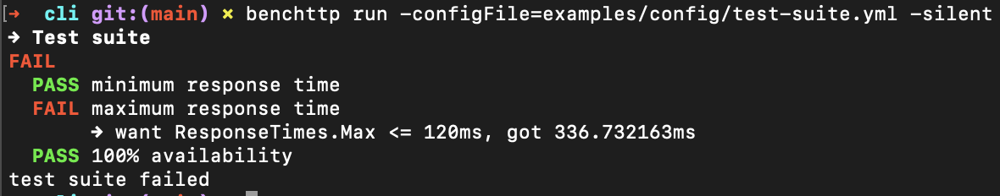

<h1 align="center">benchttp/engine</h1>

<p align="center">
  <a href="https://github.com/benchttp/engine/actions/workflows/ci.yml?query=branch%3Amain">
    </a>
  <a href="https://codecov.io/gh/benchttp/engine">
    </a>
  <a href="https://goreportcard.com/report/github.com/benchttp/engine">
    </a>
  <br />
  <a href="https://pkg.go.dev/github.com/benchttp/engine#section-documentation">
    </a>
  <a href="https://github.com/benchttp/engine/releases">
    </a>
</p>

## About

Benchttp is a command line tool for end-to-end performance testing of HTTP endpoints.


You can define performance targets for an endpoint in a declarative way and run them from the command line.

The test suite will exits with a status code 0 if successful or 1 if any test failed. This makes Benchttp very interoperable with a CI.
You can making sure your changes do not introduce any perfomance regressions.



## Installation

### Manual download

Download the latest release from the [releases page](https://github.com/benchttp/engine/releases) that matches your operating system and architecture (format is `benchttp_<os>_<architecture>`).

Rename the binary to `benchttp` and move it to a directory in your `PATH`.

```bash
mv benchttp_<os>_<architecture> benchttp

export PATH=$PATH:/path/to/benchttp

benchttp version
```

## Command line usage

```bash
# Command syntax
benchttp run [options]
```

If no options are provided, benchttp will use a default configuration with minimal options.
Only the URL is always required.

```bash
benchttp run -url https://example.com
```

### Configuration

You can override the default configuration and fine tune the Benchttp runner by either providing a configuration file (YAML or JSON) with the `-configFile` flag, or by passing individual flags to the `run` command.

Mixing configuration file and flags is possible, the flags will override the configuration file.

### Specification

Every option can be set either via command line flags or a configuration file, expect for command line only options (see below). Option names always match between the two.

#### HTTP request options

| CLI flag  | File option           | Description               | Usage example                             |
| --------- | --------------------- | ------------------------- | ----------------------------------------- |
| `-url`    | `request.url`         | Target URL (**Required**) | `-url http://localhost:8080/users?page=3` |
| `-method` | `request.method`      | HTTP Method               | `-method POST`                            |
| -         | `request.queryParams` | Added query params to URL | -                                         |
| `-header` | `request.header`      | Request headers           | `-header 'key0:val0' -header 'key1:val1'` |
| `-body`   | `request.body`        | Raw request body          | `-body 'raw:{"id":"abc"}'`                |

#### Runner options

| CLI flag          | File option             | Description                                                          | Usage example        |
| ----------------- | ----------------------- | -------------------------------------------------------------------- | -------------------- |
| `-requests`       | `runner.requests`       | Number of requests to run (-1 means infinite, stop on globalTimeout) | `-requests 100`      |
| `-concurrency`    | `runner.concurrency`    | Maximum concurrent requests                                          | `-concurrency 10`    |
| `-interval`       | `runner.interval`       | Minimum duration between two non-concurrent requests                 | `-interval 200ms`    |
| `-requestTimeout` | `runner.requestTimeout` | Timeout for every single request                                     | `-requestTimeout 5s` |
| `-globalTimeout`  | `runner.globalTimeout`  | Timeout for the whole benchmark                                      | `-globalTimeout 30s` |

Note: the expected format for durations is `<int><unit>`, with `unit` being any of `ns`, `µs`, `ms`, `s`, `m`, `h`.

#### Test suite options

Test suite options are only available via configuration file.
They must be declared in a configuration file. There is currently no way to set these via cli options.

Refer to [our Wiki](https://github.com/benchttp/engine/wiki/IO-Structures#yaml) for how to configure test suite.
You can define a test for every available [fields](https://github.com/benchttp/engine/wiki/Fields).

#### Command line only options

| CLI flag      | Description                  | Usage example                      |
| ------------- | ---------------------------- | ---------------------------------- |
| `-silent`     | Remove convenience prints    | `-silent` / `-silent=false`        |
| `-configFile` | Path to benchttp config file | `-configFile=path/to/benchttp.yml` |

## Use in CI

Benchttp can aslo be used in CI. A GitHub action is available [here](https://github.com/benchttp/action).

## How does the configuration work?

The runner uses a default configuration that can be overridden by a configuration file and/or flags. To determine the final configuration of a benchmark and which options take predecence over the others, the runner follows this flow:

1. It starts with a [default configuration](./examples/config/default.yml)
2. Then it tries to find a configuration file and overrides the defaults with the values set in it

   - If flag `-configFile` is set, it resolves its value as a path
   - Else, it tries to find a config file in the working directory, by priority order:
     `.benchttp.yml` > `.benchttp.yaml` > `.benchttp.json`

   The configuration file is _optional_: if none is found, this step is ignored.
   If a configuration file has an option `extends`, it resolves all files recursively until the root is reached and overrides the values from parent to child.

3. Then it overrides the current config values with any value set via command line flags
4. Finally, it performs a validation on the resulting config (not before!).
   This allows composed configurations for better granularity.

## Development

Requires Go version 1.17 or higher.

Build for all platforms:

```bash
./script/build
```

```bash
./script/build
```

Test:

```bash
./script/test
```

Lint:

Requires [golangci-lint](https://golangci-lint.run/).

```bash
./script/lint
```

Serve Go doc:

```bash
./script/doc
```
